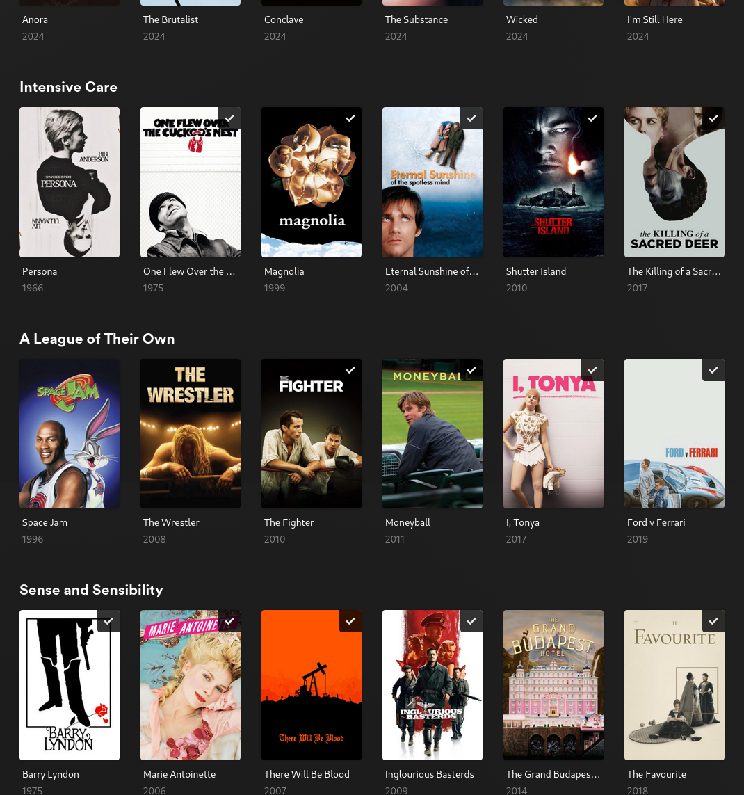

kometa-letterboxd - Letterboxd Showdowns in Plex
---
The main command is

```bash
python letterboxd.py --config config.yml
```

Initialize the project on Debian

```bash
python3 -m venv .venv
source .venv/bin/activate
pip install -r requirements.txt
```

### Background

Surfacing content in a mature Plex library that is neither chaotically random nor repetitively ordered (imdb rating, date released, top 250 X) is a great challenge.

This project uses several strategies to interface Plex with Letterboxd not achievable with Kometa directly. The first two are through a monthly serial collection, and another by custom tags.

The third is more sophisticated, integrating [Letterboxd's Showdowns](https://letterboxd.com/showdown/) feature into a Plex library.

#### List Builders

- [Dated](/lists/dated.py) - monthly Letterboxd lists of the form "favorite movies - August, 2022". Replaces the "favorite movies" with "new title", and can be made into a wrapper to dynamically build a monthly collection.

- [Tagged](/lists/tagged.py) - if you tag collections with "plex" on Letterboxd, this builder will create Kometa collections from these collections. These are handpicked films that are easier to pick and tease out of Letterboxd than anywhere else, expecially compared to Plex.

- [Showdown](/lists/showdown.py) - this is a sophisticated method.  [Letterboxd Showdowns](https://letterboxd.com/showdown/) is a page of over 250 lists, each of which are constructed by a
[motif](https://en.wikipedia.org/wiki/Motif_(narrative)) such as "Brief Encounter" or "Sense and Sensibility" that don't narrowly fit into a genre (War) or theme (political and human rights). The staff cut the aggregate list down to the 20 best represented movies for that motif.

### Showdowns in Plex




The showdowns listed here are:
[Intensive Care](https://letterboxd.com/showdown/intensive-care/): Best medical professionals in film
[Sense and Sensibility](https://letterboxd.com/showdown/sense-and-sensibility/): Best period films (transportive through costume and makeup departments)
[A League of Their Own](https://letterboxd.com/showdown/a-league-of-their-own/): Best underdog sports movies

### How Showdowns Work

A moderate sized Plex collection will have ~50 possible showdown collections with 6 movies or more.
If you tell this script to build every candidate Showdown collection, it will spam your Movies library with too many small collections.

This is restrained by:

- setting a minimum number of overlapping movies in your plex library (>=6 movies in both Plex AND a Showdown list).
- setting a "window size" (5 movies) for your daily runner of this tool. How many showdown collections should be in your library at any given time?
- setting the spotlight (1 movie). This is the center highlight of your sliding window.

For Showdown Collections a,b,..x,y,z, here's how the sliding window traverses the candidate showdown collection set to surface well-populated collections in Plex.

|       |                                  | |
| ----- | -------------------------------- |-|
| day 1 | `abcdefghijklm[NO[P]QR]stuvwxyz` | P `visible_*=true` |
| day 2 | `abcdefghijklmn[OP[Q]RS]tuvwxyz` | P `visible_library=true;visible_{home,shared}=false`  |
| day 3 | `abcdefghijklmno[PQ[R]ST]uvwxyz` | P same as last step, last day of being available |
| day 4 | `abcdefghijklmnop[QR[S]TU]vwxyz` | P -> p `delete_collection=true` |
| day 5 | `abcdefghijklmnopq[RS[T]UV]wxyz` | |

-  run1: [P] is the Plex frontpage, spotlight collection `[visible_{library,home,shared}=true]`
-  run2: P is still discoverable in the collections tab, not on homepage `[visible_{home,shared}=false;visible_library=true]`
-  run3 P: same as run 1, on its last day discoverable
-  run4 p: no longer discoverable. delete this collection on plex (i think this

Dyslexic-friendly ascii.
```
  ===[--X--]====================
  ====[--X--]===================
  =====[--X--]==================

  window (5): [--X--]
  X: the visible on home page
  -: discoverable in collections
  =: all other collections w/ threshold >= 6
```

### Usage

Better to use the configuration files, but here's a demonstration of the command line usage:

```bash
# via config file
python letterboxd.py --config config.yml

# via CLI
python3 -m lists.showdown_plex \
     --config config.yml \
     --showdown-json showdown.json \
     --threshold 6 \
     --sort matches_desc \
     --window 5 \
     --label "Showdown Spotlight"
```

See `config.example.yml` for an example config file. You can either reference your Kometa config file in your `config.yml`, or input you Plex token directly.

The first run will take around 30 minutes. The subsequent runs will only update on new Showdowns on Letterboxd.

```
.
└── data
    ├── featured
    │   └── showdown
    │       ├── cache.json
    │       └── rotation.json
    └── user
        └── dated.json
```

To avoid poluting the Git history, the cache file will be made available on for annex at a later date.

### Repo Structure

This tool is ecternal to Kometa and simple builds caches and compatible configuration files for Kometa to run on.

```
.
├── collectors
│   ├── featured
│   │   └── showdown
│   │       ├── __init__.py         # main showdown job runner
│   │       ├── probe.py            # fetch and cache letterboxd's showdown dataset
│   │       └── storage.py          # how to effectively store (helper)
│   └── user
│       ├── dated.py                # special dated lists
│       ├── lists.py                # user lists, in general
│       └── tagged.py               # tagged lists on letterboxd
├── common
│   ├── cache.py                    # json storage of letterboxd data (in general)
│   ├── kometa.py                   # build kometa-flavored yaml for direct use in Kometa
│   └── plex.py                     # purely an interface with plex
├── config.example.yml
├── config.yml                      # user config for this repo only; not kometa
├── data                            # created. TODO: move to annex/ or ~/.local/share
│   ├── featured
│   │   └── showdown
│   │       ├── cache.json          # generated from letterboxd.com/showdown/ (30 minute run)
│   │       └── rotation.json       # showdown rotation state (sliding visibility window)
│   └── user
│       └── dated.json              # for "favorite movies - August, 2022" etc
├── letterboxd.py                   # main orchestrator
├── README.md
└── requirements.txt
```

This is very much experimental. Contributions welcome!

### License

[MIT](LICENSE)
