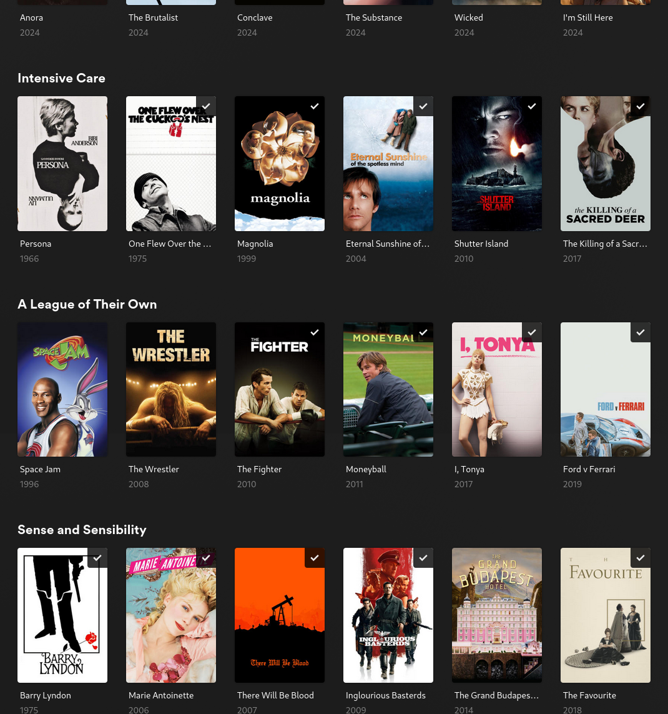

# kometa-letterboxd

Generate Kometa collections from Letterboxd lists, Showdowns, and dated collections.

## Installation

Install as a Python tool:

```bash
git clone https://github.com/brege/kometa-letterboxd
cd kometa-letterboxd
uv tool install .
```

## Usage

```bash
kometa-letterboxd --config config.yml
```

See `config.example.yml` for configuration options.

## Background

Surfacing content in a mature Plex library that is neither chaotically random nor repetitively ordered (imdb rating, date released, top 250 X) is a great challenge.

This project interfaces Plex with Letterboxd through scripting *around* Kometa. This tool builds the Kometa config files to be batched with Kometa's normal job runs. The first two are rather simple, a monthly serial collection "group" and another to build a letterboxd-tagged collection. The third is more sophisticated, integrating [Letterboxd's Showdowns](https://letterboxd.com/showdown/) feature into a Plex library. I quite like this feature on Letterboxd. Seeing these lists without context is a cross-word-like game.

### List Builders

- [Dated](/lists/dated.py):monthly Letterboxd lists of the form "favorite movies - August, 2022". Replaces the "favorite movies" with "new title", and can be made into a wrapper to dynamically build a monthly collection. This is a basic list builder I've provided to help you scaffold your own. It's too specific and probably not mush use to others.

- [Tagged](/lists/tagged.py): if you tag collections with "plex" on Letterboxd, this builder will create Kometa collections from these collections. These are handpicked films that are easier to pick and tease out of Letterboxd than anywhere else, especially compared to Plex.

- [Showdown](/lists/showdown.py): this is a sophisticated method. [Letterboxd Showdowns](https://letterboxd.com/showdown/) is a page of over 250 lists, each of which are constructed by a [motif](https://en.wikipedia.org/wiki/Motif_(narrative)) such as "Brief Encounter" or "Sense and Sensibility" that don't narrowly fit into a genre (War) or theme (political and human rights).

Importing a whole Showdown page, which Kometa can do, is problematic. These pages contain a lot of movies from users that definitely do not fit the motif. Letterboxd staff cuts the aggregate list down to the 20 best represented movies for that motif.

### Showdowns in Plex



The showdowns listed here are:
- **Intensive Care** - [letterboxd.com/showdown/intensive-care](https://letterboxd.com/showdown/intensive-care/)
- **A League of Their Own** - [letterboxd.com/showdown/a-league-of-their-own](https://letterboxd.com/showdown/a-league-of-their-own/)
- **Sense and Sensibility** - [letterboxd.com/showdown/sense-and-sensibility](https://letterboxd.com/showdown/sense-and-sensibility/)

### How Showdowns Work

A moderate sized Plex collection (500-1000 titles) will have ~50 possible showdown collections with 6 movies or more. If you tell this script to build every candidate Showdown collection, it will spam your Movies library with too many small collections.

This is restrained by:

- setting a minimum number of overlapping movies in your plex library (>=6 movies in both Plex AND a Showdown list).
- setting a "window size" (5 movies) for your daily runner of this tool. How many showdown collections should be in your library at any given time?
- setting the spotlight (1 movie). This is the center highlight of your sliding window.

#### Illustration

```
  ===[--X--]====================
  ====[--X--]===================
  =====[--X--]==================

  window (5): [--X--]
  X: the visible one on home page
  -: discoverable in collections
  =: all other collections w/ threshold >= 6
```

You can of course set the window size to 1, `[X]`, if you only want the spotlight.

### Configuration

See `config.example.yml` for an example config file. You can either reference your Kometa config file in your `config.yml`, or input your Plex token directly.

The first run will take around 30 minutes. The subsequent runs will only update when new completed Showdowns appear on Letterboxd. A pre-cache may be made externally available with enough interest.

### License

[MIT](LICENSE)
